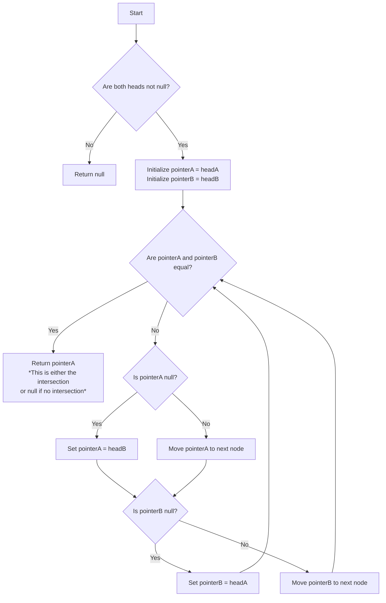

# **Linked List Intersection Algorithm Flowchart**

```mermaid
flowchart TD
    A[Start] --> B{Are both heads not null?}
    B -->|No| C[Return null]
    B -->|Yes| D[Initialize pointerA = headA\nInitialize pointerB = headB]
    D --> E{Are pointerA and pointerB equal?}
    E -->|Yes| F[Return pointerA\n*This is either the intersection\nor null if no intersection*]
    E -->|No| G{Is pointerA null?}
    G -->|Yes| H[Set pointerA = headB]
    G -->|No| I[Move pointerA to next node]
    H --> J{Is pointerB null?}
    I --> J
    J -->|Yes| K[Set pointerB = headA]
    J -->|No| L[Move pointerB to next node]
    K --> E
    L --> E
```
